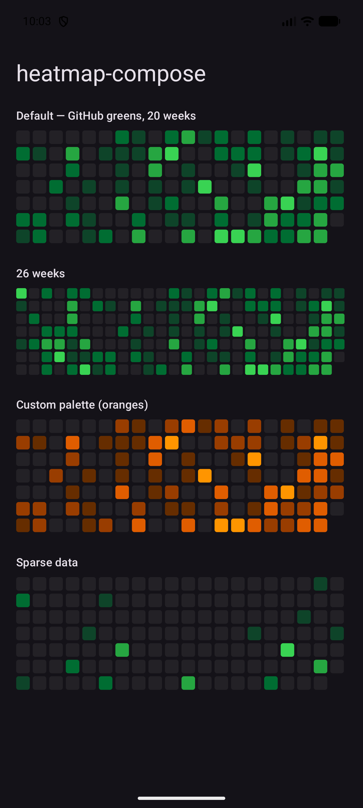

# heatmap-compose 🟩

[](https://github.com/Meko123456/heatmap-compose/actions/workflows/ci.yml)
[](LICENSE)

GitHub-style contribution heatmap for Jetpack Compose.

<p align="center">
  
</p>

## What you get

| API | For |
|---|---|
| `ContributionHeatmap` | Compose UI — a single-Canvas composable |
| `HeatmapBitmap` | Non-Compose surfaces — Glance widgets, notifications, share images |
| `HeatmapLevel` | The pure intensity math (0–4 levels), if you render yourself |

Layout mirrors github.com exactly: one column per week, Sunday-first rows,
newest week on the right. The busiest day is always the darkest green.

## Usage

```kotlin
ContributionHeatmap(
    counts = countsByDay,                     // Map<Long, Int>: epochDay -> count
    endDay = LocalDate.now().toEpochDay(),
    weeks = 20,                               // columns
    levelColors = GithubGreens,               // any 4 colors
    emptyColor = DefaultEmptyColor,
)
```

For a widget or notification:

```kotlin
val bitmap = HeatmapBitmap.render(counts = countsByDay, endDay = today, weeks = 26)
```

- **Zero dependencies** beyond `compose-ui` + `compose-foundation` — no material3
- `minSdk 26`

## Installation

Maven Central publication is in progress ([#7](../../issues/7)). Until then,
include the `:heatmap` module directly or copy the three files — MIT licensed.

```kotlin
// coming soon
implementation("io.github.meko123456:heatmap:0.1.0")
```

## Sample

The [`:sample`](sample/) module demos default palette, custom colors, week
counts, and sparse data — `./gradlew :sample:installDebug`.

Extracted from [HabitStreaks](https://github.com/Meko123456/HabitStreaks),
where it renders in-app heatmaps and two home-screen widgets.

## License

[MIT](LICENSE)
